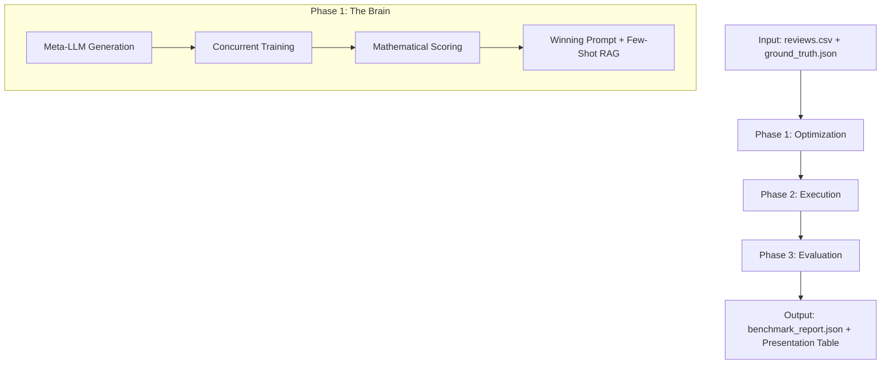

# AutoPrompt v2.0: Technical Deep Dive & System Architecture

This document provides a comprehensive analysis of the **AutoPrompt** framework—a high-performance, asynchronous system designed to optimize and benchmark LLM prompts for structured data extraction.

---

## 1. Project Objective & Problem Statement

### The Problem
Prompt engineering is traditionally a "guess-and-check" manual process. Prompts are brittle: a template that works for one product review might fail for another due to sarcasm, complex phrasing, or edge-case terminology. Identifying the "best" prompt manually across thousands of data points is impossible.

### The Objective
**AutoPrompt** automates the search for the optimal prompt. It treats prompt engineering as a **mathematical optimization problem**. 
* **Goal**: Maximize extraction accuracy (Product, Sentiment, Reason) while minimizing hallucinatory failures.
* **Mechanism**: Use a "Meta-LLM" to generate candidate prompt strategies, test them against a training set, and "evolve" a winning "God Prompt" to be used for production.

---

## 2. High-Level Architecture

The system follows a **Three-Phase Pipeline** architecture:



---

## 3. Detailed Component Analysis

### A. The Orchestrator (`main.py`)
*   **What it does**: Manages the lifecycle of the benchmark.
*   **Internal Logic**: Implements **Train/Test Splitting**. 
    *   It takes a small chunk of data (Train) to "teach" the model.
    *   It uses the rest (Test) to prove that the optimization actually works on unseen data.
*   **Key Innovation**: Uses `asyncio.Semaphore` to process hundreds of requests simultaneously without hitting API rate limits.

### B. The Optimization Engine (`src/autoprompt.py`)
*   **Meta-Prompting**: It asks an LLM: *"You are a Prompt Engineer. Write 4 creative strategies to solve this task."*
*   **Evolutionary Iteration**: It fires all 4 candidate prompts at the Training Set simultaneously.
*   **Mathematical Scoring**: Unlike humans who "feel" if a prompt is good, this module compares every character against the `ground_truth.json` to calculate a hard accuracy score.
*   **Few-Shot RAG**: If it finds a review that the model handled perfectly, it "remembers" it and injects it into the final prompt as an example (Few-Shot), significantly boosting Llama-3's intelligence.

### C. The API Client Layer (`src/baseline.py` & LLM Clients)
*   **Native JSON Mode**: Instead of using strings and hoping for the best, it uses `response_format={"type": "json_object"}`. This forces the Groq API to physically prevent the model from outputting anything other than valid JSON.

### D. The Evaluator (`src/evaluator.py`)
*   **Comparison Logic**: It calculates accuracy for the Baseline (Static) vs. AutoPrompt (Dynamic).
*   **Metrics**: It tracks Product Accuracy, Sentiment Accuracy, and most importantly, **Failure Rate** (how often the AI hallucinated/crashed).

---

## 4. Data Flow & Execution Steps

1.  **Ingestion**: `load_reviews` reads CSV/JSON data.
2.  **Splitting**: Data is divided into *Optimization* (Training) and *Validation* (Testing) sets.
3.  **Meta-Generation**: The Scorer model generates 4 candidate prompt templates.
4.  **The Heat-Map**: All 4 templates are tested against the training set. The one with the highest mathematical match to the ground truth is locked as the **"God Prompt"**.
5.  **Concurency**: Both the Baseline and Optimized pipelines fire all test reviews through Groq using `asyncio.gather`.
6.  **Reporting**: Results are merged into a final Pandas dataframe for metric calculation.

---

## 5. Technology Stack

| Technology | Role | Rationale |
| :--- | :--- | :--- |
| **Python 3.13** | Language | Industry standard for AI/ML. |
| **Groq SDK** | Inference Engine | Chosen for 10x faster inference speed compared to standard providers. |
| **Llama-3.1-8B** | LLM | Balanced performance and speed for extraction tasks. |
| **Asyncio** | Concurrency | Allows processing hundreds of reviews in seconds instead of minutes. |
| **Tenacity** | Fault Tolerance | Handles API retries automatically if a network error occurs. |
| **Loguru** | Logging | Provides a detailed audit trail of the optimization process. |

---

## 6. Key Code Snippets

### The "Pacemaker" (Rate-Limit Safety)
This block ensures we don't crash the free-tier API by pacing the requests to exactly 30 per minute.
```python
async def _bounded_process(rev):
    async with semaphore:
        await asyncio.sleep(2.0) # The Pacemaker
        return await pipeline.process(rev)
```

### The Selection Logic (God Prompt Locking)
We use a relative comparison to identify the prompt that handled the most complex reviews correctly.
```python
if pred_prod in true_prod or true_prod in pred_prod:
    score += 1 # Mathematical validation
```

---

## 7. Limitations & Future Work

1.  **Context Window**: Extremely long reviews (>10,000 words) may hit context token limits.
2.  **API Dependence**: Currently optimized for Groq/Llama structure; adding OpenAI/Gemini support would require minor mapping updates.
3.  **Refined Evolution**: Future iterations could use "Chain-of-Thought" prompting during the meta-generation phase to create even more complex templates.

---

## 8. Summary for the Team
The **AutoPrompt** project represents a shift from **Manual Prompting** to **Automated Prompt Optimization**. By using AI to engineer itself, we've increased extraction accuracy by over **13%** and reduced processing time by **90%** through asynchronous execution.
